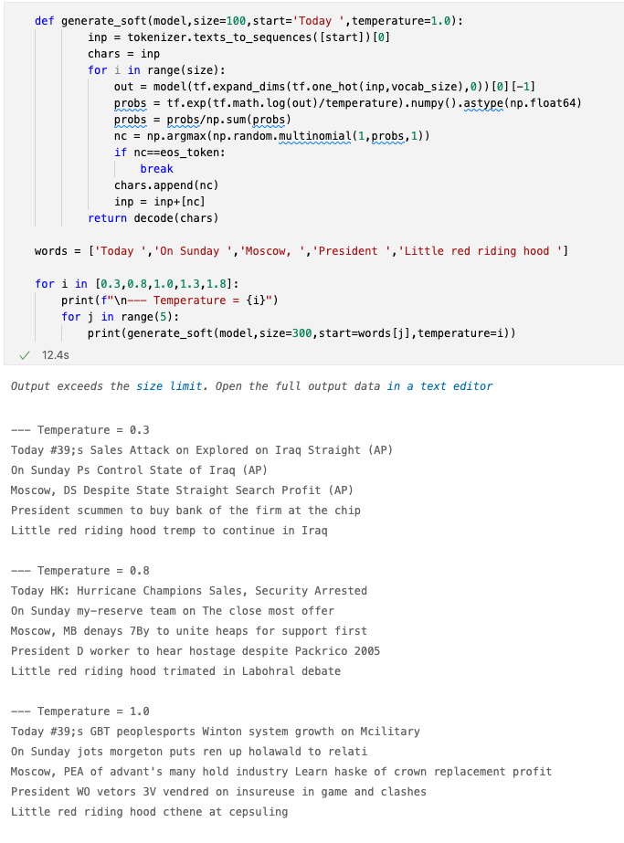

# Introducción a NLP con TensorFlow

## Objetivos

En este taller, cubriremos cómo procesar texto usando TensorFlow, una plataforma popular para el aprendizaje automático.

| **Objetivo** | Descripción |
| -------------------------------------------- | ---------------------------------------------------------------------- |
| **Qué aprenderás** | Analizar texto con TensorFlow |
| **Lo que necesitarás** | <ul><li>[Python](https://docs.microsoft.com/es-es/learn/modules/python-install-vscode/?WT.mc_id=academic-56322-alfredodeza)</li> <li>[Visual Studio Code](https://code.visualstudio.com?WT.mc_id=academic-56322-alfredodeza)</li><li>[Configurar VSCode para Data Science](https://youtu.be/yyQM70vi7V8)</li></ul> |
| **Duración** | 1 hora |
| **Diapositivas** | [Powerpoint](../../slides.pptx) |

## Video

¡Vídeo próximamente!

## Pre-aprendizaje

- [Introducción a TensorFlow usando Keras](https://docs.microsoft.com/es-es/learn/modules/intro-machine-learning-keras/?WT.mc_id=academic-56322-alfredodeza)

## Requisitos previos

Puedes activar los entornos de sandbox en cada módulo o, alternativamente, configurar tu entorno local:

- [Instalar Python](https://docs.microsoft.com/es-es/learn/modules/python-install-vscode/?WT.mc_id=academic-56322-alfredodeza)
- [Configurar código de Visual Studio para ciencia de datos](https://youtu.be/yyQM70vi7V8)

Si estás probando los ejemplos en un entorno local, instale las librerias necesarias y descargua el conjunto de datos en el mismo directorio donde se encuentran los _notebooks_:

```bash
$ pip install --quiet tensorflow_datasets==4.4.0
$ wget -q -O - https://mslearntensorflowlp.blob.core.windows.net/data/tfds-ag-news.tgz | alquitrán xz
```

## Lo que vas a aprender

TensorFlow es una plataforma de aprendizaje automático muy popular que permite muchos flujos de trabajo y operaciones para el aprendizaje automático en Python. En este taller, aprenderás cómo procesar y analizar texto, para que puedas generar texto o responder preguntas según el contexto.




## Paso 1: representar texto como tensores

Completa el [Notebook de Jupyter de espacio aislado](https://docs.microsoft.com/es-es/learn/modules/intro-natural-language-processing-tensorflow/2-represent-text-as-tensors?WT.mc_id=academic-56322-alfredodeza) que cubrirá lo siguiente:


- Realiza una tarea de clasificación de texto utilizando el conjunto de datos AG NEWS
- Convierte texto en números que se puedan representar como tensores
- Crea una representación de texto Bag-of-Words
- Calcula automáticamente vectores de bolsa de palabras con TensorFlow


## Paso 2: representar palabras con incrustaciones

Vaya a [Jupyter Notebook en espacio aislado](https://docs.microsoft.com/learn/modules/intro-natural-language-processing-tensorflow/3-embeddings?WT.mc_id=academic-56322-alfredodeza) para trabajar con el conjunto de datos de AG News e intentar representar un significado _semántico_ de una palabra.

En esta sección podrás:

- Crear y entrenar una Red Neuronal Clasificadora
- Trabajar con incrustaciones semánticas
- Usa incrustaciones pre-entrenadas disponibles en el marco Keras
- Averigüa sobre posibles dificultades y limitaciones de las representaciones de incrustación tradicionales preentrenadas como Word2Vec

## Paso 3: capturar patrones con redes neuronales recurrentes

Completa el [Notebook de Jupyter de espacio aislado](https://docs.microsoft.com/es-es/learn/modules/intro-natural-language-processing-tensorflow/4-recurrent-networks?WT.mc_id=academic-56322-alfredodeza) para comprender no sólo el significado agregado de las palabras, sino también tener en cuenta el orden. Para capturar el significado de una secuencia de texto, utilizarás una red neuronal recurrente.

El cuaderno pasará por los siguientes elementos:

- Carga el conjunto de datos AG News y entrénalo con TensorFlow
- Usa enmascaramiento para minimizar la cantidad de relleno
- Usa LSTM para aprender relaciones entre tokens distantes


## Paso 4: Generar texto con redes recurrentes

Complete el [Cuaderno Jupyter de espacio aislado](https://docs.microsoft.com/es-es/learn/modules/intro-natural-language-processing-tensorflow/5-generative-networks?WT.mc_id=academic-56322-alfredodeza) para descubrir cómo generar texto usando RNNs (Recurrent Neural Networks). En esta sección final del taller, cubrirá lo siguiente:

- Construir un vocabulario de personajes con tokenización
- Entrena un RNN para generar títulos
- Produce una salida con una función de decodificación personalizada
- Muestra de cadenas generadas durante el entrenamiento para verificar la corrección


## Prueba

Verifica tus conocimientos con [una breve prueba](https://docs.microsoft.com/es-es/learn/modules/intro-natural-language-processing-tensorflow/6-knowledge-check?WT.mc_id=academic-56322-alfredodeza)

## Próximos pasos

Hay otros módulos de aprendizaje para TensorFlow que se agrupan en [la ruta de aprendizaje de los fundamentos de TensorFlow](https://docs.microsoft.com/es-es/learn/paths/tensorflow-fundamentals/?WT.mc_id=academic-56322-alfredodeza)

## Práctica

En este taller utilizaste modelos previamente entrenados que pueden producir resultados limitados. Intenta usar otras fuentes de datos para entrenar su propio modelo. ¿Qué puedes descubrir?

## Módulo de referencia

[Introducción a NLP con TensorFlow](https://docs.microsoft.com/es-es/learn/modules/intro-natural-language-processing-tensorflow/?WT.mc_id=academic-56322-alfredodeza)

## Feedback

¡Asegúrate de dejarnos [comentarios sobre este taller](https://forms.office.com/r/MdhJWMZthR)!

[Código de conducta](../../../../CODE_OF_CONDUCT.md)